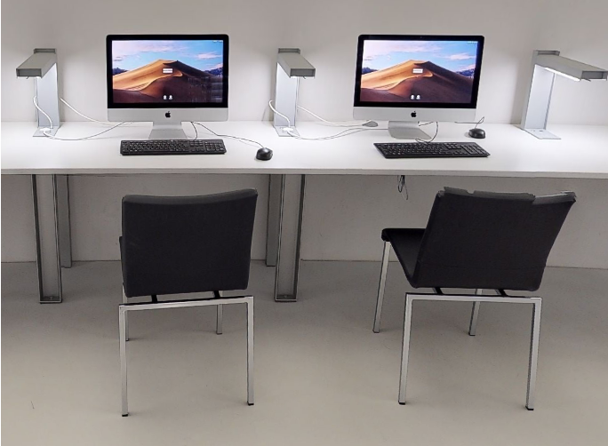

# mac-laboratory
notes and scripts for setting up laboratory macs for many users. This is a work in progress.



##### License: CC BY-NC-SA 4.0 (https://creativecommons.org/licenses/by-nc-sa/4.0/)


## Purpose
Create a mac with the following characteristics:
- Set desired computer name
- Restart on freeze
- Disable sleep command in Apple Menu and remove from Login window.
- Remove Shutdown from Apple Menu and Login window. 
- Allow login using AD user
- Install Kyocera driver
- Print through a network Papercut printer
- Do not display welcome wizards on first login
- Shut down mac daily, ignoring any logged-in users
- Clear existing user profiles on boot
- Boot daily @ 07:30
- Shut down daily @ 00:15
- Enable multiple languages for all users, and auto-activate the input menu in the menu bar. (Note: this currently enables english & greek - will be updated with instructions on adding other languages)


## Assumptions
- The local administrator user is ```admin```
- You can add and/or remove mobileconfig profiles as you see fit.

## Prerequisites
1. Edit ```configure.sh``` and set you desired print server and print queue ```smb://<print_server>/<print_queue>```
2. Edit ```profiles/activeDirectoryPayload.mobileconfig``` and replace ```YOUR_DOMAIN```, ```YOUR_NETWORK_USERNAME```,  ```YOUR_NETWORK_USERNAME``` and ```YOUR_ORG_OU```. Your AD administrator will provide you with these information. (Note: YOUR_DOMAIN requires the server's fqdn).

## Execution
- Clone or download repository
- Execute with ```sudo ./configure.sh```

A confirmation will pop-up during execution about Terminal trying to administer your computer. This is expected. Click OK.


## Attributions
- Management profiles for OS X / macOS https://github.com/rtrouton/profiles
